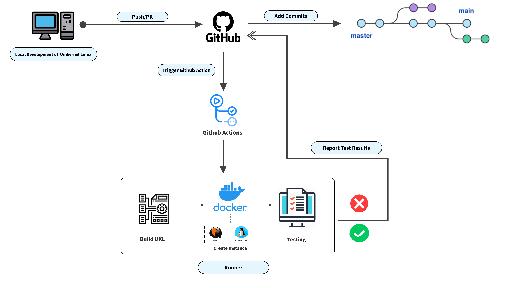

** **
# A CI for Development of UKL
** **
Project Members:  
- Wiley Hunt | whunt@bu.edu  
- Zhassulan Kaishentayev | jassulan@bu.edu  
- Camden Kronhaus | kronhaus@bu.edu  
- Samantha Puterman | samanpg@bu.edu  

## 1. Vision and Goals Of The Project:

The UKL CI will provide a testing system to support continuous integration for the development of the Linux unikernel (UKL) open source project. High-level goals of this project include:  
* Creating a series of workflows (automated testing scripts) via GitHub Actions which will:
  - Automatically compile the UKL (and all dependencies) with a series of test programs (each test program will be compiled and tested separately).
  - Ensure the compiled UKL is able to be booted in QEMU and all test applications produce the expected output.

These workflows will be triggered by pushes and pull requests to the main UKL development branch ([ukl-5.14](https://github.com/unikernelLinux/linux/tree/ukl-5.14)). In addition, the workflows will be configured to run nightly (~12AM ET) as well as via a manual ["workflow dispatch"](https://github.blog/changelog/2020-07-06-github-actions-manual-triggers-with-workflow_dispatch/), which allows a user to run workflows via a button on the GitHub UI.

** **
## 2. Users/Personas Of The Project:

The UKL CI will be used by all developers for the open source UKL project who contribute to the [UKL’s GitHub repository](https://github.com/unikernelLinux/linux) via either a push or a pull request.

Notably, it does not target:
* Developers of non-UKL related projects

** **
## 3. Scope and Features Of The Project:

The UKL CI will consist primarily of a series of workflow scripts (written in [YAML](https://docs.github.com/en/actions/learn-github-actions/workflow-syntax-for-github-actions) as this is the markup language used by GitHub to configure workflows within GitHub Actions) which are automatically triggered to run whenever pushes or pull requests are initiated in the repository (specifically on the current development branch, [ukl-5.14](https://github.com/unikernelLinux/linux/tree/ukl-5.14)). The workflows will also run nightly via a cron-based scheduler in GitHub Actions, and can be manually triggered by a user via the GitHub UI.

These workflow scripts include: 
* A "Unit Tests" Workflow which runs the following test programs in the UKL (inside the QEMU emulator). Note: each program runs in parallel as a separate ["job"](https://docs.github.com/en/actions/learn-github-actions/workflow-syntax-for-github-actions#jobs) (a series of Linux commands/scripts used to execute a test) that runs on its own GitHub-hosted ["runner"](https://docs.github.com/en/actions/using-github-hosted-runners/about-github-hosted-runners) (a virtual machine hosted by GitHub in Azure).
  - Boot Test: A simple program that tests whether the UKL can successfully be booted in QEMU.
  - LEBench System Calls Test: A test program (based on a modified version of the LEBench performance evaluation program provided by our mentors) which ensures that several common system calls (read, write, etc.) can run successfully in the UKL.
  - Multi-threaded Test: A test program that ensures that a multithreaded application (using the pthreads library) can successfully run in the UKL.
  - Memcached Test: A unit test which runs memcached in the UKL and tests the ability to set/get key value pairs in this memcached server from the "host" (the virtual machine in which this test runs). This unit test not only tests that memcached (which is a multi-threaded application) can run in the UKL, but also tests the networking capabilities of the UKL (as set/get commands are sent from the host to the UKL over the network).

* A "Configurations Tests" Workflow which compiles the UKL with each combination of the following UKL-specific configuration flags (UKL_SAME_STACK, UKL_USE_IST_PF, UKL_USE_RET) and runs the LEBench System Calls test. Each test for a different combination of UKL configuration flags runs in parallel as a separate "job" on its own "runner".

* A "Latency Test" Workflow which compiles a modified version of the LEBench program provided by our mentors (which reports the total time required for each individual system call test in the program) with the UKL and runs it in QEMU. This test has been implemented as a POC and tested on the following types of machines: GitHub-hosted VM (in Azure), self-hosted VM (in the MOC), and a physical server in Cloud Lab. This test has been added to the main unikernelLinux/linux repository, but is currently deactivated (so it does not run automatically) as our mentors do not have a dedicated machine for this test (which would produce consistent results). The test can easily be activated should the project secure a server they wish to dedicate to this test.

* In addition, we created a reusable "Cloning" Script (that is used by all workflows) which clones all the dependency repositories required for compiling the UKL (unikernelLinux/ukl, unikernelLinux/Linux-Configs, unikernelLinux/min-initrd, unikernelLinux/glibc, gcc-mirror/gcc) and installs tools needed to build the UKL and run it in QEMU. We created this script as a way to simplify our workflows as each "job" within a workflow can simply call this script directly (rather than a developer needing to copy/paste the same cloning steps into every new "job" within a workflow).

The source code for individual test programs and shell scripts used to automate tests within these workflows are stored in the actions-files branch of the [unikernelLinux/ukl](https://github.com/unikernelLinux/ukl/tree/actions-files) repository (which also contains the main UKL Makefile). In addition, the workflows utilize the files in the actions-files branch of the [unikernelLinux/min-initrd](https://github.com/unikernelLinux/min-initrd/tree/actions-files) repository (which contains a Makefile to build the root file system and launch the UKL in QEMU), which have been modified for our unit tests and updated to run in Ubuntu.

** **
## 4. Solution Concept
### Global Architecture Description
Below is a description of the major components of our overall UKL CI system.
* GitHub Actions: A set of workflows triggered by a push, pull request, manual dispatch via the GitHUb UI, or cron-based schedule to launch a runner and execute tests.
* Runner: Server (running Linux) responsible for executing each "job" (a collection of Linux commands and Bash scripts which build/test the UKL) within a workflow. Note: Our workflows use multiple runners so that different tests can be run independently in parallel.

                  
                              Figure 1: Basic Overview of Architecture/Workflow

  
Figure 1 details the overall architecture and workflow of the UKL CI system. 
* A push or pull request from a user on the unikernelLinux/linux repository (on branch 5.14) will trigger our workflows (see description above) which will launch a Linux-based runner for each "job" (test) in the workflows (Note: the tests also run nightly via a cron-based scheduler in GitHub actions, and can be manually triggered by a user via the GitHub UI). 
* Each runner will subsequently clone all required repositories for building the UKL, install dependencies, and execute a Makefile to build the UKL (and a pre-defined test application) as a bootable kernel image. This kernel image will then be used to boot the UKL in the QEMU emulator. The output of the test program will be stored in a file, and Bash scripts will be executed to check the output to ensure that the test program runs as expected.
  
#### Design Implications and Discussion
##### Running Actions on GitHub-Hosted Runners: 

Currently, all of our workflows/tests run on GitHub-hosted runners. The principal reason for this design decision is that this allowed us to build a self-contained CI system, which does not rely on external machines outside of GitHub (which the repository owner would be responsible for managing). Moreover, GitHub offers unlimited build minutes for public repositories (such as our project). In addition, while a single job within a workflow cannot run for more than 6 hours, all of our tests are able to complete well within this time limit (the longest task within each job is the compilation of the UKL, which takes ~35-40 minutes on a GitHub-hosted runner). Finally, GitHub allows free-tier users to run up to 20 runners concurrently, which allows us to execute our workflows in parallel.
 
However, there are a few limitations to using GitHub-hosted runners, which are described below:
   * GitHub-hosted runners limit the available memory to 7GB RAM and 14GB SSD. While this is not an issue for our current system, it could become a limiting factor if future tests require more memory than is available on GitHub machines. 
   * GitHub hosted runners do not support running QEMU with KVM, which makes QEMU run much more slowly. While our mentors have defined this "slow performance" as acceptable for the current system, it could become an impedence for future tests where better performance is an imperative.
   * As would be expected, GitHub-hosted runners do not allow us to test the UKL on bare metal. While we did not implement bare-metal testing as part of our system, any future tests designed to be run in a bare metal environment would require the use of self-hosted (non-Github) machines.
   * We noticed some significant variability in the performance of the GitHub runners in executing workflow jobs. For example, while a job in a workflow may take 35 minutes on one "run" (execution of the job on a runner), that same job may take 50 minutes when run again (on a new runner). This variability in performance limits the ability to capture consistent latency metrics on a GitHub-hosted runner which could be used for evaluating performance regressions. 

In order to support any future testing on non-GitHub machines, we did experiment with running our Latency Test as a Proof of Concept on self-hosted runners in both the MOC (on a VM) and in Cloud Lab (on a physical machine). We've added this Latency Test workflow to the [main UKL development repository](https://github.com/unikernelLinux/linux/actions), but have deactivated it (so it will not run) for now. In addition, we have provided documentation to our mentors for setting up self-hosted runners should this be required in the future.

** **
## 5. Acceptance criteria
Minimum acceptance criteria is a CI running in GitHub actions that will test patches pushed to the UKL repository (or initiated via pull requests) by building the UKL, booting QEMU, and running test programs to alert the user if the patch breaks the code.

Stretch goals for this project include:
* Running build/test scripts on runners hosted outside of GitHub (such as at the MOC). 
* Testing for performance regressions as patches are pushed to the UKL or introduced via pull request.

** **
## 6. Project Task Board, Repositories, and Sprint Videos
* Our Taiga Board can be found [here](https://tree.taiga.io/project/anqianqi1-csec528-fall-21-a-ci-for-development-of-ukl/timeline)

* CI testing and development was performed in our [fork of the UKL repo](https://github.com/whunt1965/linux/tree/ukl-5.14/.github/workflows)

* Completed Workflows are available in the [main UKL repo](https://github.com/unikernelLinux/linux/tree/ukl-5.14/.github/workflows)

* Sprint Demo Videos
  - Sprint 1: https://drive.google.com/file/d/1uyXb03ig_F_Q8udL5lgs5sNOPHZjnRgZ/view?usp=sharing
  - Sprint 2: https://drive.google.com/file/d/159fcWlAx-YyuqLVU3G0UOF5Mf6WIg77E/view?usp=sharing
  - Sprint 3: https://drive.google.com/file/d/1rxiRq5U2SMQPrR4_HnuqhIxqB6eEjs84/view?usp=sharing
  - Sprint 4: https://drive.google.com/file/d/1D601Hhs6gQDGnI2LJIvR5eQfntei2Qeu/view?usp=sharing
  - Sprint 5: https://drive.google.com/file/d/1MqF_6at1HVH_peVMaq6H9_b3S3NzCuok/view?usp=sharing

** **
## 7.  Release Planning:

### Release #1: Test UKL Compilation in GitHub Actions 
***Implemented in Main UKL Repo on 10/5***

Github Action to run a workflow that compiles the UKL whenever there is a push or a pull request to the main [unikernelLinux/linux repository](https://github.com/unikernelLinux/linux/). This workflow reports a success if the patch introduced no compilation failures or a failure if the patch caused the UKL not to compile. 

Note: This original test has been replaced by subsequent tests which compile the UKL as part of the overall workflow.

### Release #2: Test Booting the UKL in GitHub Actions

***Implemented in Main UKL Repo on 11/2***

Github Action to run a workflow that tests compiling the UKL and booting it in QEMU. The UKL is compiled with a simple test program which simply prints a string after the UKL boots and subsequently exits. The output of QEMU is redirected to a file, which is subsequently checked (via a Bash Script) to ensure that it contains the string printed by the test program. The workflow reports a success if the string is in the output file (indicating a successful boot) and a failure if the string is not found.

Note: After developing this action in our [forked UKL repository](https://github.com/whunt1965/linux/blob/ukl-5.14/.github/workflows/UKL_UNIT_TESTS.yml), we elected to hold off on adding it to the main UKL repository until we developed additional unit tests (as outlined in Release 3).

### Release #3: Initial Unit Tests and Configurations Test

***Implemented in Main UKL Repo on 11/2***

Implement GitHub Action Workflows in the main UKL repository to run an initial set of Unit Tests (on both pushes and pull requests) as well as test different combinations of UKL-specific configuration flags. Each test within the workflow individually compiles the UKL with a test program, boots the UKL in QEMU, and checks the output of QEMU (by streaming all QEMU output to a file which can be analyzed with a Bash script when QEMU shuts down) to ensure that the test program executed successfully. 

Our initial Unit Test Workflow includes: 
* A Boot Test which simply ensures that the UKL boots successfully (by checking the QEMU output for a string printed in the test program when the UKL boots). See Release 2 above.
* A System Calls Test which runs a modified version of LEBench (provided by our mentors) that ensures that each of the system calls run in the program completes successfully (by checking the QEMU output for a unique string printed after each of the system call tests complete)

Our Configurations Test Workflow includes:
* A set of tests which compile the UKL with each permutation of the specialized UKL configurations (developed by the UKL team) and ensures that the UKL can boot/run the above System Calls Test program in QEMU. 

These workflows were first run (and evaluated) in [our fork](https://github.com/whunt1965/linux) of the UKL repo and were added to the main UKL repo on repository on 11/2. These workflows can be viewed [here](https://github.com/unikernelLinux/linux/actions).

### Release #4: Final Unit Tests and Latency Test

***Implemented in Main UKL Repo on 11/20***

Implement the following additional unit tests to the Unit Tests workflow: 
* A test program to test running memcached in the UKL to test networking capabilities. This test compiles and runs memcached in the UKL (inside QEMU) and tests whether the "host" runner (the machine in which the workflow is running) can read and write to memcached. 
* A test program to ensure UKL applications can run multiple threads. This test runs an application which spawns multiple threads (which each perform a simple task), joins them, and prints a string indicating successful completion. We then check the output extracted from QEMU for this string to make sure that the test ran successfully. 

Implement a Latency Test Workflow and Test in different environments
* Our Latency Test workflow executes a program which runs various system calls (based on the LEBench program provided by our mentors) and measures the time each system call test takes to complete. We then extract these times from the output of QEMU and report them to the GitHub Actions console (and terminate the action to report an error if not all tests run). This test is a proof of concept for how latencies may be measured via GitHub actions and was tested on the following different typrs of machines: Github-hosted runner (VM in Azure), self-hosted runner (VM) in MOC, and self-hosted physical server in Cloud Lab. This test was added to the main UKL/linux repository but has been "deactivated" for now as the project does not have a server to dedicate to this test.

These tests were first run (and evaluated) in [our forked repository](https://github.com/whunt1965/linux/actions) and have subsequently been implemented in the main unikernelLinux/linux repository [here](https://github.com/unikernelLinux/linux/actions)

### Release #5: Final Deliverables

***Target Delivery Date to Mentors: 11/29***

We have now validated and implemented our CI system into the [main UKL repository](https://github.com/unikernelLinux/linux/actions). For the final release, we are preparing the following for our mentors:
* A simple build script to test compiling/running an application in the UKL (locally):
  -  We have created a simple Bash script which automatically compiles the UKL, builds a target application, and runs it in QEMU. This script (and its associated documentation) has been added to a new repository within the project [here](https://github.com/unikernelLinux/ukl-build)
* Detailed Documentation on our CI System: 
  - This document has been prepared and is available [here](https://drive.google.com/file/d/1A9FgZH2z_6a2OhLThzloncJ8-Cw_VIW9/view?usp=sharing). We are completing a final review before sending to our mentors. 
* Tutorial on GitHub Actions
  - We have prepared a (short) document providing an overview of GitHub actions and some of the lessons we learned through our project. This document will be provided to both our mentors and the course staff so that future projects may make use of it. 
  - The document is available [here](https://drive.google.com/file/d/1EzBzWF8HaBPzDV7etRpRBnJh6UTzIvAB/view?usp=sharing). We are completing a final review before sending to our mentors. 

** **
## 8. Final Deliverables and Instructions for Running

### Source Code
* Our final workflow files may be found in the ukl-5.14 branch of the unikernelLinux/linux repository [here](https://github.com/unikernelLinux/linux/tree/ukl-5.14/.github/workflows)
* In addition, as mentioned above, our workflow files use special branches of the dependency repositories required for compiling the UKL.
    - Our branch (actions-files) of the unikernelLinux/ukl repository may be found [here](https://github.com/unikernelLinux/ukl/tree/actions-files). This repository contains a specialized Makefile, test program source code, and shell scripts used by the workflows for building and testing the UKL. 
    -  Our branch (actions-files) of the unikernelLinux/min-initrd repository may be found [here](https://github.com/unikernelLinux/min-initrd/tree/actions-files). This repository contains a Makefile and scripts used by the workflows for building the root file system and running the UKL in QEMU. 
    -  Note: We have implemented our actions files as separate branches in these repositories to prevent conflicts with our mentors' own development files, especially since many of the files in these repositories had to be modified to run on Ubuntu (which is the Linux distribution used by GitHub-hosted runners).

* Full details on the our workflow and test files (as well the modifications we made to existing UKL dependency build files) may be found in our UKL Project Documentation [here](https://drive.google.com/file/d/1A9FgZH2z_6a2OhLThzloncJ8-Cw_VIW9/view?usp=sharing).

### Additional Deliverables
In addition to the code we developed for the CI System, we have produced 2 separate additional written deliverables for this project.
* Detailed Project Documentation for our CI system can be found [here](https://drive.google.com/file/d/1A9FgZH2z_6a2OhLThzloncJ8-Cw_VIW9/view?usp=sharing)
* An overview of GitHub Actions (and tips for usage) can be found [here](https://drive.google.com/file/d/1EzBzWF8HaBPzDV7etRpRBnJh6UTzIvAB/view?usp=sharing)

### Instructions for Running/Testing
As this system is designed to be run in GitHub actions, it unfortunately cannot be downloaded and run on a local machine. However, we provide instructions below which can be used to run our system/test its functionality via GitHub. 
#### Option 1: Running System via Workflow Dispatch (Recommended)
As mentioned above, our workflows can be run manually via a "workflow dispatch" button in the GitHub UI. To run workflows with this mechanism, you can follow the below steps:
* Navigate to the Actions tab of the unikernelLinux/linux repository [here](https://github.com/unikernelLinux/linux/actions). 
* Select either the "UKL CONFIGS TEST" workflow or "UKL UNIT TESTS" workflow in the left hand column.
* Click the "Run workflow" button on the right hand side of the screen. This will immediately run the selected workflow and all corresponding tests.
* The output of this workflow can be viewed from this same screen (and previous workflows can also be inspected).

#### Option 2: Forking the unikernelLinux/linux Repository and Running Workflows in the Fork
Alternatively, you can "fork" the unikernelLinux/linux repository and run the workflows in the fork. If you choose to test via this route, though, some additional set-up is needed:
* As the UKL relies on several private repositories (unikernelLinux/ukl, unikernelLinux/min-initrd, unikernelLinux/Linux-Configs, unikernelLinux/glibc), you will need to be granted access by the unikernelLinux project owners.
* Then, to access these repositories from the workflow, you will need to first create an access token in your forked repository (see instructions [here](https://docs.github.com/en/authentication/keeping-your-account-and-data-secure/creating-a-personal-access-token)) and then add this token as a repository secret named "UKLCLI" (see instructions for creating repository secrets [here](https://docs.github.com/en/actions/security-guides/encrypted-secrets)).

After following the above set-up steps, the actions can be run via workflow dispatch or by initiating pushes or pull requests to the forked repository. 

