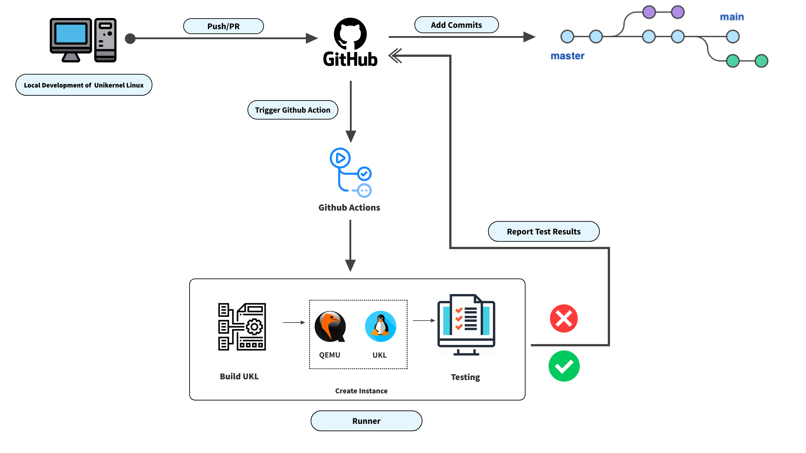

** **
# A CI for Development of UKL
** **
Project Members:  
- Wiley Hunt | whunt@bu.edu  
- Zhassulan Kaishentayev jassulan@bu.edu  
- Camden Kronhaus | kronhaus@bu.edu  
- Samantha Puterman | samanpg@bu.edu  

## 1.   Vision and Goals Of The Project:

The UKL CI will provide a system to support continuous integration for the development of the linux unikernel (UKL) open source project. High level goals of this project include:  
* Providing a system of GitHub Actions to automatically compile the UKL, glibc and dependencies, and run test programs after any pushes and pull requests to the UKL repository to identify any bugs in the new features. 
* Ensuring the compiled kernel is able to boot and run on QEMU and produces the expected output.

## 2. Users/Personas Of The Project:
** **
The UKL CI will be used by all contributors to the open source UKL project who contribute to the [UKL’s GitHub repository](https://github.com/unikernelLinux/linux) via either a push or a pull request.

Notably, it does not target:
* Developers of non-UKL related projects

## 3.   Scope and Features Of The Project:

** **
The UKL CI will consist primarily of a series of scripts which are automatically triggered by GitHub Actions whenever pushes or pull requests are initiated in the repository (specifically on the current development branch, ukl-5.14). These scripts will include: 
* A build script which:

    * Fetches all repositories required for the unikernel compilation (unikernelLinux/ukl, unikernelLinux/linux, unikernelLinux/Linux-Configs, unikernelLinux/min-initrd, unikernelLinux/glibc, gcc-mirror/gcc)
  * Builds gcc, glibc, and other dependencies
  * Compiles the UKL kernel and application
* A boot script to launch a QEMU instance with the compiled UKL as the kernel
* Automated shell scripts which will run tests to ensure that QEMU boots and subsequently run test programs in QEMU to compare the actual output of these programs with expected results. 

## 4. Solution Concept
Global Architecture Description
Below is a description of the major components of our overall UKL CI system.**
* GitHub Actions: Triggered by a push or pull request to launch a runner and run CI scripts
* Runner: Server (running Linux) responsible for executing build scripts to clone UKL and dependency repositories, boot QEMU, and run test scripts. Note: currently, we are actually using multiple runners so that different tests can be run independently in parallel.

                  
                              Figure 1: Basic Overview of Architecture/Workflow

  
Figure 1 details the overall architecture and workflow of the UKL CI system. A push or pull request from a user on the unikernelLinux/linux repository (on branch 5.14) will trigger a GitHub action which will launch Linux-based runner for each test in the CI system. Each runner will subsequently clone all required repositories for building the UKL, install dependencies, and execute a Makefile to build the UKL (and a pre-defined test application) as a bootable kernel image. This kernel image will then be used to boot a QEMU emulator. Upon booting, test scripts will be executed to check the output of the emulator to ensure that the test program(s) complete successfully.
  
Design Implications and Discussions
* Running all actions on GitHub Hosted Runners: 
 - Currently, we plan to execute all build/test scripts on runners (machines) provided by GitHub. The principal reason for this design decision is that this will allow us to build a self-contained CI system (ie, not relying on external machines outside of GitHub). GitHub offers unlimited build minutes for public repos (although a job cannot run for more than 6 hours), which shoudl be more than sufficient for a build (currently, the kernel takes approximately 40 minutes to compile). However the machine memory is capped at 7GB RAM and 14GB SSD, so if additional memory is needed as we would develop tests, we would need to explore using self-hosted runners. Making this change would require us to set-up a 3rd-party VM to handle the Build/Test scripts whenever the GitHub action is triggered and subsequently clean up all created files after the action completes. 
 - By using GitHub hosted runners, we cannot run QEMU with KVM. This makes QEMU much more slowly. While our mentors have defined this "slow performance" as acceptable for now, we will need to ensure that it does not become an issue later on when we add more tests/compile the UKL with different applications.
 - As would be expected, GitHub-hosted runners do not allow us to test the UKL on bare metal. This is a stretch goal for the project, but should we get to that task, we will need to switch to using the MOC or another source where bare-metal testing is possible.

Repositories:

* Currently, CI testing and development is being performed in our [fork of the UKL repo](https://github.com/whunt1965/linux)

* As releases are completed, they are added to the [main UKL repo](https://github.com/unikernelLinux/linux)

## 5. Acceptance criteria
Minimum acceptance criteria is a CI running in GitHub actions that will test patches pushed to the UKL repository (or initiated via pull requests) by building the UKL, booting QEMU, and running test programs to alert the user early if the patch breaks the code.

Stretch goals for this project include:
* Running all build/test scripts on runners hosted outside of GitHub (such as at the MOC). This will provide greater flexibility in what type of system that kernel is built on (GitHub is limited to Ubuntu for Linux) and may allow us to test the kernel in bare metal.
* Testing for performance regressions as patches are pushed to the UKL or introduced via pull request (note: we do not currently have a methodology for doing this, so this will involve additional research should we pursue this goal).

## 6.  Release Planning:
** **
Our Taiga Board can be found [here](https://tree.taiga.io/project/anqianqi1-csec528-fall-21-a-ci-for-development-of-ukl/timeline)

Release #1: Completed 10/5

Github Action to run a workflow that compiles the UKL repository, glibc, gcc and other dependencies whenever there is a push or a pull request to the UKL repository and return the workflow status to the user, which can be success if the patch pushed introduced no failures or a failure status if the patch caused the repository not to compile. 

Action can be found [here](https://github.com/unikernelLinux/linux/actions)

Release #2: Target Completion Date: <strike>10/11</strike> 10/30

Launching a QEMU instance through a boot script with the compiled UKL as the kernel and testing that it boots correctly. Note: This task was completed as one of the initial "unit tests" created for release 3. The action is available [here](https://github.com/whunt1965/linux/blob/ukl-5.14/.github/workflows/UKL_UNIT_TESTS.yml) and output of the action may be viewed [here](https://github.com/whunt1965/linux/actions/workflows/UKL_UNIT_TESTS.yml). Our plan is to release this feature along with other initial unit tests in Release 3.

Release #3: 10/30**

Implement GitHub Action Workflows to individually compile the UKL with a test program, boot the UKL in QEMU, and check the output of QEMU (by streaming all QEMU output to a file which can be analyzed with a Bash script when QEMU shuts down) to ensure that the test program executed successfully. Note: We currently have 3 "starter" unit tests: a test which simply ensures that the UKL boots, a test which runs a few simple system calls and ensures that each part of the program completes successfully, and a test which compiles the UKL with each permutation of the specialized UKL configurations (developed by the UKL team) and ensures that the UKL can boot/run a test program in QEMU. The first two tests are available [here](https://github.com/whunt1965/linux/blob/ukl-5.14/.github/workflows/UKL_UNIT_TESTS.yml) and output of the action may be viewed [here](https://github.com/whunt1965/linux/actions/workflows/UKL_UNIT_TESTS.yml). The configurations tests are available [here](https://github.com/whunt1965/linux/actions/workflows/UKL_CONFIG_TESTS.yml) and the output of these tests can be found [here](https://github.com/whunt1965/linux/blob/ukl-5.14/.github/workflows/UKL_CONFIG_TESTS.yml).

* Note: We plan to discuss with our mentors on 10/27 whether we should go ahead and add these initial tests to the main UKL repo or wait until further tests have been developed.

Release #4: 

Create and add additional unit tests to the workflow. These tests should include (at a minimum): a multithreaded application and memcached (to test networking). Additional system call tests may also be implemented based on feedback from our mentors. 

Release #5: 

After delivering MVP (Releases 1-3), implement additional stretch targets as prioritized by our mentors (eg, running on bare metal or implement performance regression tests).*

*In our conversations thus far with our mentor (Richard) he has emphasized the MVP as the most valuable feature. We’ve spoken about the other (stretch) goals, but plan to revisit these with him after delivering the MVP. Based on this conversation, we can subsequently implement whichever features will drive the most value for the UKL project in the time remaining. 

## Computing Resources we may need
At the moment, we are operating on free-tier virtual machines for testing purposes and our initial plan is to use the machines running in GitHub for production. However, if we need to switch to self-hosted runners, we will need access to virtual machines (running Linux with atleast 20GB RAM which can receive triggers from GitHub actions and subsequently run the all build and test scripts. 
** **
## Sprint Demo Videos

Sprint 1: https://drive.google.com/file/d/1uyXb03ig_F_Q8udL5lgs5sNOPHZjnRgZ/view?usp=sharing

Sprint 2: https://drive.google.com/file/d/159fcWlAx-YyuqLVU3G0UOF5Mf6WIg77E/view?usp=sharing
